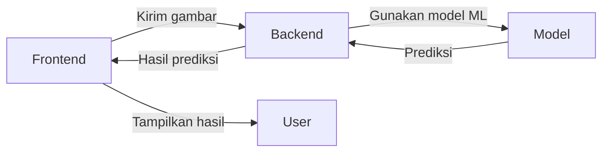

# SilenBackEnd-ML

SilenBackEnd-ML adalah backend untuk aplikasi berbasis Machine Learning (ML) yang menggunakan Flask sebagai server API dan berinteraksi dengan model ML yang dilatih. Proyek ini mencakup pemrosesan data, pelatihan, evaluasi model, dan utilitas deteksi tangan menggunakan MediaPipe. Model ML diunduh dari Google Drive saat aplikasi dijalankan.

---

## Struktur Folder

```
silenBackEnd-ML-main/
├── .dockerignore
├── .gitattributes
├── .gitignore
├── .railwayignore
├── Dockerfile
├── README.md
├── app.py
├── railway.json
├── requirements.txt
│
├── data/
│   └── models/         # Tempat penyimpanan model ML
│   └── .gitkeep        # Menandai folder agar tetap ter-track
│
├── src/
    ├── __init__.py
    ├── data_preprocessing/
    │   ├── __init__.py
    │   ├── augmentation.py       # Augmentasi gambar
    │   ├── data_loader.py        # Pemrosesan dataset
    │   └── feature_extractor.py  # Ekstraksi fitur tangan
    │
    ├── models/
    │   ├── __init__.py
    │   ├── train_model.py        # Pelatihan model
    │   └── evaluate_model.py     # Evaluasi model
    │
    └── utils/
        ├── __init__.py
        └── mediapipe_utils.py    # Deteksi tangan dengan MediaPipe
```

---

## Machine Learning (Python)

* **Bahasa:** Python 3.11

* **Framework & Library:**

  * TensorFlow 2.15.0
  * Keras 2.15.0
  * scikit-learn 1.3.0
  * MediaPipe 0.10.10
  * OpenCV (headless) 4.8.0.76
  * NumPy, Pandas, Joblib, Pickle
  * H5py, Matplotlib, Seaborn, tqdm
  * ONNX, ONNX Runtime, TF2ONNX

* **Fungsi:**

  * Preprocessing: Augmentasi dan ekstraksi fitur tangan
  * Training: Pelatihan model klasifikasi tangan
  * Evaluation: Perhitungan metrik performa
  * Inference: Prediksi data gambar

---

## Frontend (React)

* **Bahasa:** JavaScript (ES6+)

* **Framework & Library:**

  * React.js, React DOM, React Router DOM
  * Vite, Tailwind CSS, PostCSS, Autoprefixer
  * @mediapipe/hands, @tensorflow/tfjs, Axios
  * Lucide React, FontAwesome, ESLint

* **Fungsi:**

  * Antarmuka pengguna untuk kamera & unggah gambar
  * Komunikasi dengan Flask API
  * Menampilkan hasil inferensi secara real-time

---

## Backend (Flask)

* **Bahasa:** Python 3.11

* **Library:**

  * Flask, Flask-CORS, Gunicorn
  * Requests, Pillow, NumPy, Pandas
  * Base64, JSON, Pathlib

* **Deployment:**

  * Docker, Railway
  * Base image: python:3.11-slim-buster
  * Dependencies tambahan: libgl1-mesa-glx, libsm6, libxext6, libglib2.0-0, libfontconfig1, libxrender1

* **Fungsi:**

  * Endpoint API untuk menerima gambar dan merespons hasil prediksi
  * Mengunduh model dari Google Drive saat runtime

### Endpoint `app.py`

* `/api/translate` → POST gambar dan terima hasil prediksi
* `/api/health` → Cek status API
* `/api/load_model` → Unduh model dari Google Drive

---

## Alur Data



---

## Cara Menjalankan

### 1. Install dependencies

```bash
pip install -r requirements.txt
```

### 2. Melatih model (opsional)

```bash
python main.py
```

### 3. Jalankan server Flask

```bash
python app.py
```

API tersedia di: `http://localhost:5000`

### 4. Unduh model dari Google Drive

```bash
curl -X GET http://localhost:5000/api/load_model
```

### 5. Kirim gambar untuk prediksi

```bash
curl -X POST http://localhost:5000/api/translate -F "image=@/path/to/image.jpg"
```

---

## 🔗 Google Drive

Model dan dataset disimpan di Google Drive dan akan diunduh saat aplikasi berjalan.

> Pastikan Anda memiliki akses ke folder Google Drive terkait.

Link: **[Google Drive Folder](#)**
